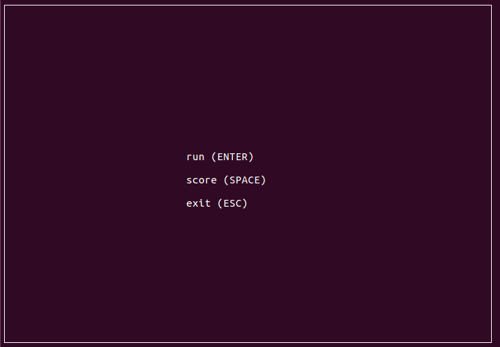
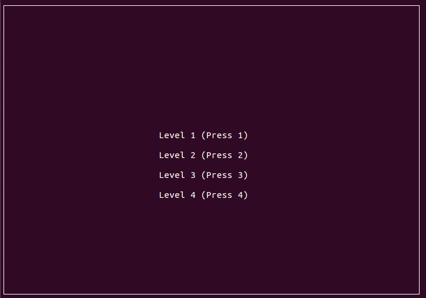
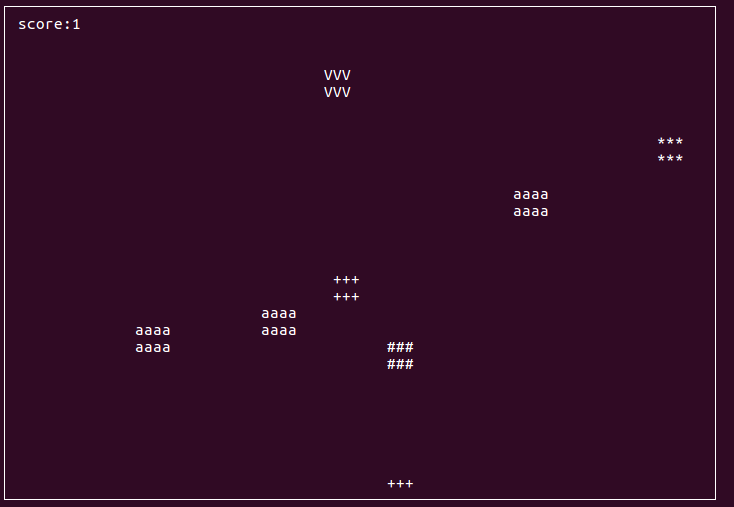
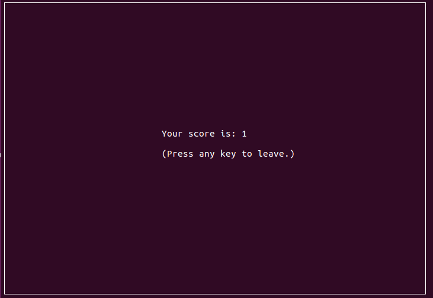

Simple game on c++ imitating Arkanoid.  
Semestral work from class BI-PA2 (Programming and Algorithms 2) was intended to show,  
that I have basic knowledge of OOP principles.  

Libraries:  
ncurses- for text-based user interface on terminal.  
doxygen- for documentation.  

<b> Game Story </b>

Year 3200. Humanity became multigalactic species with the main capital galaxy Milky Way. Planet Earth, from where humans originated, was destroyed, because of a nuclear war between Earth's supreme government and opposition movement, which demanded legalization of free cryptocurrency without taxes. Half of the population died because of the radiation and eventually humans divided into two groups Sapien Imperiums and Sapien Libers and abandoned Earth to search for a separate planets to live. Beginning of a new era of our civilization is considered to be colonization of Mars. Find out what happened in an adventurous game Arkanoid.

  
  
  
  

